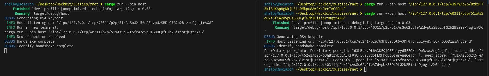

A p2p networking stack library in Rust.

Compile:
```
cargo build
```

Run the latest idenitfy protocol exchange via:
```
cargo run bin -- host

# In another terminal
cargo run bin -- host <destination-addr>
```

